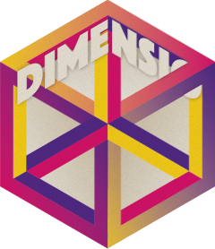

<!-- README.md is generated from README.Rmd. Please edit that file -->

```{r, include = FALSE}
knitr::opts_chunk$set(
  collapse = TRUE,
  comment = "#>",
  fig.path = "man/figures/README-",
  out.width = NULL
)
```

# dimensio 

<!-- badges: start -->
[](https://github.com/tesselle/dimensio/actions)
[](https://codecov.io/gh/tesselle/dimensio)

[](https://www.repostatus.org/#active)
[](https://www.tidyverse.org/lifecycle/#stable)
<!-- badges: end -->

Simple Principal Components Analysis (PCA) and Correspondence Analysis (CA) based on the Singular Value Decomposition (SVD). This package provides S4 classes and methods to compute, extract, summarize and visualize results of multivariate data analysis.

There are many very good packages for multivariate data analysis (such as [**FactoMineR**](http://factominer.free.fr/), [**ade4**](https://pbil.univ-lyon1.fr/ade4/) or [**ca**](https://cran.r-project.org/package=ca), all extended by [**FactoExtra**](https://rpkgs.datanovia.com/factoextra)). **dimensio** is designed to be as simple as possible, providing all the necessary tools to explore the results of the analysis.

## Installation

You can install the released version of **dimensio** from [CRAN](https://CRAN.R-project.org) with:

```{r cran-installation, eval=FALSE}
install.packages("dimensio")
```

And the development version from [GitHub](https://github.com/) with:

```{r gh-installation, eval=FALSE}
# install.packages("remotes")
remotes::install_github("tesselle/dimensio")
```

## Usage

```{r packages-load}
## Load packages
library(dimensio)

library(ggplot2)
library(ggrepel)
library(khroma)
```

```{r pca}
## Select 25 random supplementary individuals
set.seed(12345)
sup <- sample(nrow(iris), size = 25, replace = TRUE)

## Compute PCA
## (non numeric variables are automatically removed)
X <- pca(iris, scale = TRUE, sup_ind = sup)
```

### Summarize

```{r summary}
## Summarize results for the individuals (first two components)
summary(X, margin = 1, rank = 2)
```

### Extract

**dimesion** provides several methods to extract the results: 

* `get_data()` returns the original data.
* `get_contributions()` returns the contributions to the definition of the principal dimensions.
* `get_coordinates()` returns the principal coordinates.
* `get_correlations()` returns the correlations between variables and dimensions.
* `get_cos2()` returns the cos^2^ values (i.e. the quality of the representation of the points on the factor map).
* `get_eigenvalues()` returns the eigenvalues, the percentages of variance and the cumulative percentages of variance.

```{r extract}
## Eigenvalues
get_eigenvalues(X)
```

### Visualize

**dimensio** uses [**ggplot2**](https://github.com/tidyverse/ggplot2) for plotting informations. Visualization methods produce graphics with as few elements as possible: this makes it easy to customize diagrams (e.g. using extra layers, themes and scales).

```{r plot-ind, fig.width=5, fig.height=3.5, fig.show='hold'}
## Plot active individuals by group
plot_individuals(X, group = iris$Species, active = TRUE, sup = FALSE) +
  ggplot2::stat_ellipse() + # Add ellipses
  ggplot2::theme_bw() + # Change theme
  khroma::scale_color_contrast() # Custom color scale

## Plot all individuals by cos2
plot_individuals(X, highlight = "cos2", active = TRUE, sup = TRUE) +
  ggplot2::theme_bw() + # Change theme
  khroma::scale_color_iridescent() # Custom color scale
```

```{r plot-var, fig.width=3.5, fig.show='hold'}
## Plot variables factor map
plot_variables(X) +
  ggrepel::geom_label_repel() + # Add repelling labels
  ggplot2::theme_bw() + # Change theme
  ggplot2::theme(legend.position = "bottom") # Edit theme

## Highlight contributions
plot_variables(X, highlight = "contrib") +
  ggrepel::geom_label_repel() + # Add repelling labels
  ggplot2::theme_bw() + # Change theme
  ggplot2::theme(legend.position = "bottom") + # Edit theme
  khroma::scale_color_YlOrBr(range = c(0.5, 1)) # Custom color scale
```

```{r plot-eig, fig.width=3.5, fig.height=3.5, fig.show='hold'}
## Plot eigenvalues
plot_eigenvalues(X) +
  ggplot2::theme_bw() # Change theme

## Plot percentages of variance
plot_variance(X, cumulative = TRUE) +
  ggplot2::geom_text(nudge_y = 3) + # Add labels
  ggplot2::theme_bw() # Change theme

## Plot variables contributions to the definition of the first component
plot_contributions(X, margin = 2, axes = 1) +
  ggplot2::theme_bw() + # Change theme
  ggplot2::theme( # Edit theme
    # Rotate x axis labels
    axis.text.x = ggplot2::element_text(angle = 45, hjust = 1, vjust = 1)
  )
```

## Contributing
Please note that the **dimensio** project is released with a [Contributor Code of Conduct](https://github.com/tesselle/dimensio/blob/master/.github/CODE_OF_CONDUCT.md). By contributing to this project, you agree to abide by its terms.
