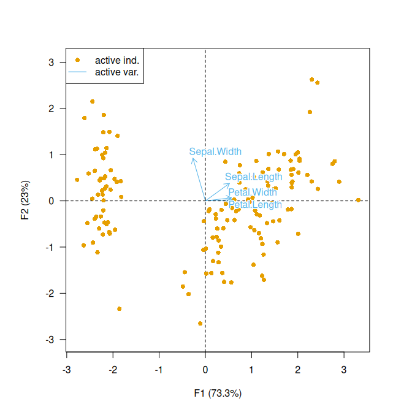
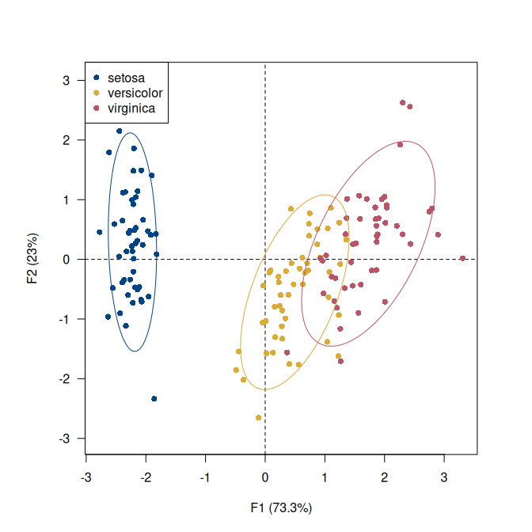
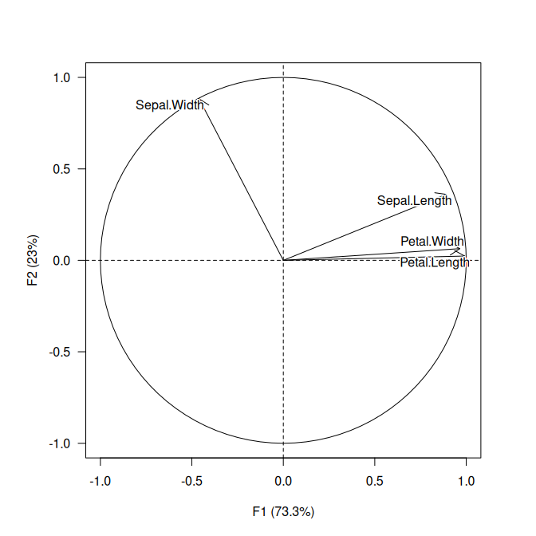

<!-- README.md is generated from README.Rmd. Please edit that file -->

# dimensio 

<!-- badges: start -->

[](https://github.com/tesselle/dimensio/actions)
[](https://app.codecov.io/gh/tesselle/dimensio)
[](https://www.codefactor.io/repository/github/tesselle/dimensio/overview/main)
[](https://cran.r-project.org/package=dimensio)

<a href="https://tesselle.r-universe.dev/dimensio"
class="pkgdown-devel"></a>
<a href="https://cran.r-project.org/package=dimensio"
class="pkgdown-release"></a> <a
href="https://cran.r-project.org/web/checks/check_results_dimensio.html"
class="pkgdown-release"></a>
<a href="https://cran.r-project.org/package=dimensio"
class="pkgdown-release"></a>

[](https://www.repostatus.org/#active)

[](https://doi.org/10.5281/zenodo.4478530)
<!-- badges: end -->

## Overview

Simple Principal Components Analysis (PCA; see `vignette("pca")`) and
(Multiple) Correspondence Analysis (CA) based on the Singular Value
Decomposition (SVD). This package provides S4 classes and methods to
compute, extract, summarize and visualize results of multivariate data
analysis. It also includes methods for partial bootstrap validation.

There are many very good packages for multivariate data analysis (such
as [**FactoMineR**](http://factominer.free.fr/),
[**ade4**](https://pbil.univ-lyon1.fr/ade4/),
[**vegan**](https://rpubs.com/brouwern/veganpca) or
[**ca**](https://cran.r-project.org/package=ca), all extended by
[**FactoExtra**](https://rpkgs.datanovia.com/factoextra/)). **dimensio**
is designed to be as simple as possible, providing all the necessary
tools to explore the results of the analysis.

------------------------------------------------------------------------

To cite dimensio in publications use:

Frerebeau N (2024). *dimensio: Multivariate Data Analysis*. Université
Bordeaux Montaigne, Pessac, France. <doi:10.5281/zenodo.4478530>
<https://doi.org/10.5281/zenodo.4478530>, R package version 0.10.0,
<https://packages.tesselle.org/dimensio/>.

This package is a part of the tesselle project
<https://www.tesselle.org>.

## Installation

You can install the released version of **dimensio** from
[CRAN](https://CRAN.R-project.org) with:

``` r
install.packages("dimensio")
```

And the development version from [GitHub](https://github.com/) with:

``` r
# install.packages("remotes")
remotes::install_github("tesselle/dimensio")
```

## Usage

``` r
## Load package
library(dimensio)
```

### Compute

``` r
## Load data
data(iris)

## Compute PCA
X <- pca(iris, center = TRUE, scale = TRUE, sup_quali = "Species")
```

### Extract

**dimensio** provides several methods to extract the results:

- `get_data()` returns the original data.
- `get_contributions()` returns the contributions to the definition of
  the principal dimensions.
- `get_coordinates()` returns the principal or standard coordinates.
- `get_correlations()` returns the correlations between variables and
  dimensions.
- `get_cos2()` returns the cos<sup>2</sup> values (i.e. the quality of
  the representation of the points on the factor map).
- `get_eigenvalues()` returns the eigenvalues, the percentages of
  variance and the cumulative percentages of variance.

### Visualize

The package allows to quickly visualize the results:

- `biplot()` produces a biplot.
- `screeplot()` produces a scree plot.
- `viz_rows()`/`viz_individuals()` displays row/individual principal
  coordinates.
- `viz_columns()`/`viz_variables()` displays columns/variable principal
  coordinates. `viz_variables()` depicts the variables by rays emanating
  from the origin (both their lengths and directions are important to
  the interpretation).
- `viz_contributions()` displays (joint) contributions.
- `viz_cos2()` displays (joint) cos<sup>2</sup>.

The `viz_*()` functions allow to highlight additional information by
varying different graphical elements (color, transparency, shape and
size of symbols…).

``` r
## Form biplot
biplot(X, type = "form")
```



``` r
## Highlight species
viz_individuals(
  x = X, 
  extra_quali = iris$Species, 
  color = c("#004488", "#DDAA33", "#BB5566")
)
## Add ellipses
viz_tolerance(
  x = X, 
  group = iris$Species, 
  level = 0.95,
  color = c("#004488", "#DDAA33", "#BB5566")
)

## Highlight petal length
viz_individuals(
  x = X,
  extra_quanti = iris$Petal.Length,
  color = color("iridescent")(255), 
  size = c(1, 2)
)
```



``` r
## Plot variables factor map
viz_variables(X)

## Scree plot
screeplot(X, eigenvalues = FALSE, cumulative = TRUE)
```



## Contributing

Please note that the **dimensio** project is released with a
[Contributor Code of Conduct](https://www.tesselle.org/conduct.html). By
contributing to this project, you agree to abide by its terms.

## References

<div id="refs" class="references csl-bib-body hanging-indent"
entry-spacing="0">

<div id="ref-aitchison2002" class="csl-entry">

Aitchison, John, and Michael Greenacre. 2002. “Biplots of Compositional
Data.” *Journal of the Royal Statistical Society: Series C (Applied
Statistics)* 51 (4): 375–92. <https://doi.org/10.1111/1467-9876.00275>.

</div>

<div id="ref-gower1966" class="csl-entry">

Gower, J. C. 1966. “Some Distance Properties of Latent Root and Vector
Methods Used in Multivariate Analysis.” *Biometrika* 53 (3-4): 325–38.
<https://doi.org/10.1093/biomet/53.3-4.325>.

</div>

<div id="ref-greenacre1984" class="csl-entry">

Greenacre, Michael J. 1984. *Theory and Applications of Correspondence
Analysis*. London ; Orlando, Fla: Academic Press.

</div>

<div id="ref-greenacre2007" class="csl-entry">

———. 2007. *Correspondence Analysis in Practice*. Seconde edition.
Interdisciplinary Statistics Series. Boca Raton: Chapman & Hall/CRC.

</div>

<div id="ref-greenacre2010" class="csl-entry">

———. 2010. *Biplots in Practice*. Bilbao: Fundación BBVA.

</div>

<div id="ref-lebart2006" class="csl-entry">

Lebart, Ludovic, Marie Piron, and Alain Morineau. 2006. *Statistique
exploratoire multidimensionnelle : Visualisations et inférences en
fouilles de données*.

</div>

<div id="ref-lockyear2013" class="csl-entry">

Lockyear, Kris. 2013. “Applying Bootstrapped Correspondence Analysis to
Archaeological Data.” *Journal of Archaeological Science* 40 (12):
4744–53. <https://doi.org/10.1016/j.jas.2012.08.035>.

</div>

<div id="ref-ringrose1992" class="csl-entry">

Ringrose, T. J. 1992. “Bootstrapping and Correspondence Analysis in
Archaeology.” *Journal of Archaeological Science* 19 (6): 615–29.
<https://doi.org/10.1016/0305-4403(92)90032-X>.

</div>

</div>
