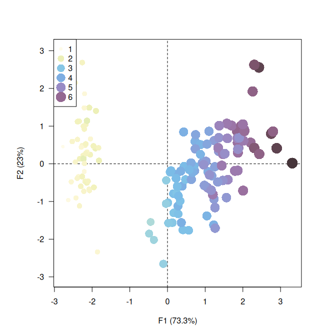
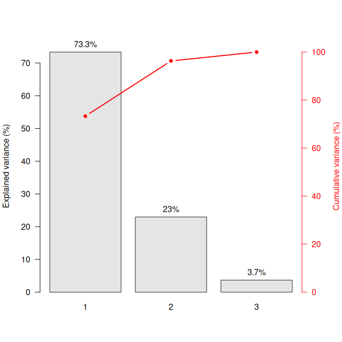

<!-- README.md is generated from README.Rmd. Please edit that file -->

# dimensio 

<!-- badges: start -->

[](https://github.com/tesselle/dimensio/actions)
[](https://codecov.io/gh/tesselle/dimensio)

[](https://www.repostatus.org/#active)

[](https://doi.org/10.5281/zenodo.4478530)
<!-- badges: end -->

Simple Principal Components Analysis (PCA) and Correspondence Analysis
(CA) based on the Singular Value Decomposition (SVD). This package
provides S4 classes and methods to compute, extract, summarize and
visualize results of multivariate data analysis. It also includes
methods for partial bootstrap validation.

There are many very good packages for multivariate data analysis (such
as [**FactoMineR**](http://factominer.free.fr/),
[**ade4**](https://pbil.univ-lyon1.fr/ade4/) or
[**ca**](https://cran.r-project.org/package=ca), all extended by
[**FactoExtra**](https://rpkgs.datanovia.com/factoextra)). **dimensio**
is designed to be as simple as possible, providing all the necessary
tools to explore the results of the analysis.

## Installation

You can install the released version of **dimensio** from
[CRAN](https://CRAN.R-project.org) with:

``` r
install.packages("dimensio")
```

And the development version from [GitHub](https://github.com/) with:

``` r
# install.packages("remotes")
remotes::install_github("tesselle/dimensio")
```

## Usage

``` r
## Load packages
library(dimensio)

library(ggplot2)
library(ggrepel)
library(khroma)
```

``` r
## Load data
data(iris)

## Compute PCA
## (non numeric variables are automatically removed)
X <- pca(iris, center = TRUE, scale = TRUE)
#> 1 qualitative variable was removed: Species.
```

### Summarize

``` r
## Summarize results for the individuals (first two components)
summary(X, margin = 1, rank = 2)
#> --- Principal Components Analysis (PCA) -----------------------------------------
#> 
#> Eigenvalues:
#>    eigenvalues variance cumulative
#> F1       2.918   73.342     73.342
#> F2       0.914   22.970     96.312
#> F3       0.147    3.688    100.000
#> 
#> Active individuals:
#>     dist PC1_coord PC1_contrib PC1_cos2 PC2_coord PC2_contrib PC2_cos2
#> 1  2.319    -2.265       1.172    0.954    -0.480       0.168    0.043
#> 2  2.202    -2.081       0.989    0.893     0.674       0.331    0.094
#> 3  2.389    -2.364       1.277    0.979     0.342       0.085    0.020
#> 4  2.378    -2.299       1.208    0.935     0.597       0.260    0.063
#> 5  2.476    -2.390       1.305    0.932    -0.647       0.305    0.068
#> 6  2.555    -2.076       0.984    0.660    -1.489       1.617    0.340
#> 7  2.468    -2.444       1.364    0.981    -0.048       0.002    0.000
#> 8  2.246    -2.233       1.139    0.988    -0.223       0.036    0.010
#> 9  2.592    -2.335       1.245    0.812     1.115       0.907    0.185
#> 10 2.249    -2.184       1.090    0.943     0.469       0.160    0.043
#> (150 more)
```

### Extract

**dimesion** provides several methods to extract the results:

-   `get_data()` returns the original data.
-   `get_contributions()` returns the contributions to the definition of
    the principal dimensions.
-   `get_coordinates()` returns the principal coordinates.
-   `get_correlations()` returns the correlations between variables and
    dimensions.
-   `get_cos2()` returns the cos<sup>2</sup> values (i.e. the quality of
    the representation of the points on the factor map).
-   `get_eigenvalues()` returns the eigenvalues, the percentages of
    variance and the cumulative percentages of variance.

``` r
## Eigenvalues
get_eigenvalues(X)
#>    eigenvalues  variance cumulative
#> F1   2.9184978 73.342264   73.34226
#> F2   0.9140305 22.969715   96.31198
#> F3   0.1467569  3.688021  100.00000
```

### Visualize

**dimensio** uses [**ggplot2**](https://github.com/tidyverse/ggplot2)
for plotting informations. Visualization methods produce graphics with
as few elements as possible: this makes it easy to customize diagrams
(e.g. using extra layers, themes and scales).

``` r
## Plot active individuals by group
plot_rows(X, group = iris$Species) +
  ggplot2::stat_ellipse() + # Add ellipses
  ggplot2::theme_bw() + # Change theme
  khroma::scale_color_contrast() # Custom color scale

## Plot all individuals by cos2
plot_rows(X, highlight = "cos2") +
  ggplot2::theme_bw() + # Change theme
  ggplot2::scale_size_continuous(range = c(1, 3)) + # Custom size scale
  khroma::scale_color_iridescent() # Custom color scale
```



``` r
## Plot variables factor map
plot_columns(X) +
  ggrepel::geom_label_repel() + # Add repelling labels
  ggplot2::theme_bw() # Change theme

## Highlight contributions
plot_columns(X, highlight = "contrib") +
  ggrepel::geom_label_repel() + # Add repelling labels
  ggplot2::theme_bw() + # Change theme
  khroma::scale_color_YlOrBr(range = c(0.5, 1)) # Custom color scale
```



``` r
## Plot eigenvalues
plot_variance(X, variance = FALSE, cumulative = FALSE) +
  ggplot2::theme_bw() # Change theme

## Plot percentages of variance
plot_variance(X, variance = TRUE, cumulative = TRUE) +
  ggplot2::geom_text(nudge_y = 3) + # Add labels
  ggplot2::theme_bw() # Change theme

## Plot variables contributions to the definition of the first component
plot_contributions(X, margin = 2, axes = 1) +
  ggplot2::geom_text(nudge_y = 2) + # Add labels
  ggplot2::theme_bw() + # Change theme
  ggplot2::theme( # Edit theme
    # Rotate x axis labels
    axis.text.x = ggplot2::element_text(angle = 45, hjust = 1, vjust = 1)
  )

## Plot cos2
plot_cos2(X, margin = 2, axes = c(1, 2)) +
  ggplot2::geom_text(nudge_y = 0.05) + # Add labels
  ggplot2::theme_bw() + # Change theme
  ggplot2::theme( # Edit theme
    # Rotate x axis labels
    axis.text.x = ggplot2::element_text(angle = 45, hjust = 1, vjust = 1)
  )
```


### Validation

``` r
## Partial bootstrap
Y <- bootstrap(X, n = 30)

## Plot with ellipses
plot_columns(Y) +
  ggplot2::stat_ellipse() + # Add ellipses
  ggplot2::theme_bw() # Change theme
```

<!-- -->

## Contributing

Please note that the **dimensio** project is released with a
[Contributor Code of
Conduct](https://github.com/tesselle/dimensio/blob/master/.github/CODE_OF_CONDUCT.md).
By contributing to this project, you agree to abide by its terms.
